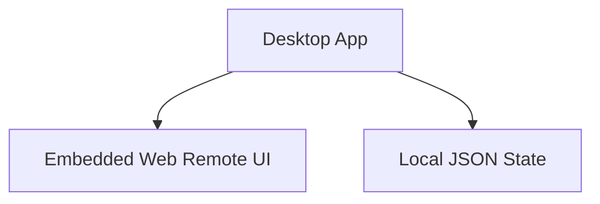
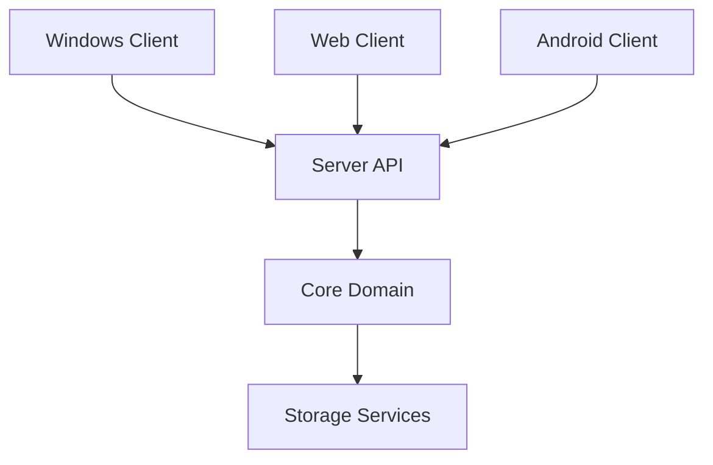
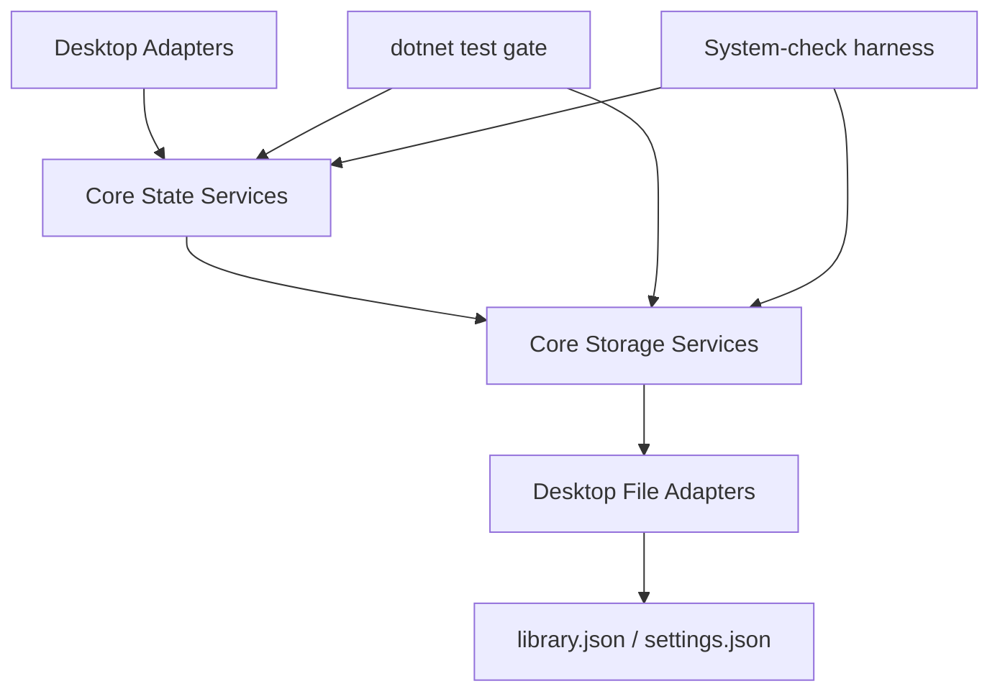

# Architecture

## Current State (M0 baseline)

## Target State

## M0/M1 Boundary

- M0 introduces the target repo layout and project stubs without changing runtime behavior.
- M1 extracts pure domain logic into `ReelRoulette.Core` with desktop adapters calling into core.
- Desktop UI remains the shipping runtime while core extraction happens by feature slice.

## M2 Storage-State Layering

- Core state services own randomization/filter/playback session primitives.
- Core storage services own JSON load/save and atomic write semantics.
- Desktop retains UI/media rendering concerns and uses adapters for persistence/state access.
