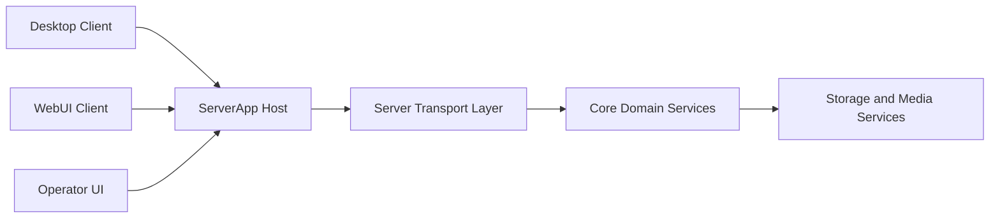

# Architecture

This document describes the current architecture of ReelRoulette and the boundaries contributors should preserve.
It is intentionally current-state only and does not track milestone chronology.

## Architecture Direction

ReelRoulette is an API-first, thin-client system:

- Core/server owns business logic and authoritative state.
- Desktop and WebUI are orchestration and rendering clients over API plus SSE.
- Shared contracts in `shared/api/openapi.yaml` align behavior across clients.

## High-Level Runtime Topology

## Runtime Ownership

### ServerApp Host

`src/core/ReelRoulette.ServerApp` is the default runtime entrypoint.

- Hosts API, SSE, media, and static WebUI surfaces on a consolidated runtime path.
- Serves Operator UI and control-plane endpoints.
- Owns runtime lifecycle and settings apply/restart orchestration.
- Uses a thin host-UI abstraction:
  - Windows host path uses native tray runtime controls (`NotifyIcon`) for operator shortcuts.
  - non-Windows host path remains headless-compatible.
- Owns host-level startup-launch registration behavior:
  - Windows path uses per-user startup registration and exposes immediate toggle control via tray and Operator UI.
  - Linux path uses XDG autostart (`*.desktop`) with `Exec=`/`Path=` aimed at the stable binary (AppImage: **`APPIMAGE`** on-disk path, not the `/tmp/.mount_*` process path); the host pins ASP.NET content root to `AppContext.BaseDirectory` so autostart works when the session manager uses a non-install cwd.
  - Other non-Windows hosts without Linux XDG use a no-op startup-launch service without affecting server-core behavior.

### Server Transport Layer

`src/core/ReelRoulette.Server` is a thin composition boundary.

- Handles endpoint routing, auth middleware wiring, SSE/media transport, and DTO shaping.
- Maps transport contracts to domain services.
- Must not become the owner of business rules that belong in core services.

### Core Domain Layer

`src/core/ReelRoulette.Core` and server-side domain services are authoritative for behavior and state semantics.

- Own domain mutation rules, projection inputs, and persistence semantics.
- Execute library operations, refresh pipeline behavior, and randomization/filter logic.
- Expose deterministic APIs for all migrated client flows.

### Client Layers

- Desktop client (`src/clients/desktop/ReelRoulette.DesktopApp/`, Avalonia) and WebUI (`src/clients/web/ReelRoulette.WebUI`) are orchestration/render layers.
- WebUI ships a small **PWA** surface (`manifest.webmanifest`, `index.html` install meta, `public/icons/*`, root `public/sw.js` registered in secure contexts for Chromium installability); build-time sync resizes shared PNG sources so declared icon sizes match shipped assets (see `scripts/sync-shared-icon.mjs`).
- Playback filtering and preset catalogs are edited through API-backed UIs on both clients (no client-authoritative filter catalogs).
- Clients issue command/query calls through APIs and project state from API plus SSE.
- WebUI Auto Tag (like duplicate scan/apply) performs filename/path matching only on the server; the web client sends scan scope and applies selected suggestions via API without client-local tag-matching authority.
- Clients must not reintroduce local authoritative mutation fallbacks for migrated domains.
- Library export/import applies zip packaging and JSON path remapping on the server; the desktop supplies UI and writes only imported `desktop-settings.json` locally after a successful import.

## Contracts and Compatibility

- OpenAPI (`shared/api/openapi.yaml`) is the source of truth for endpoint and schema contracts.
- `/api/version` and `/api/capabilities` provide compatibility and capability metadata used for client gating.
- Generated client contracts should stay in sync with OpenAPI and be verified in normal gates.

## Eventing and Projection

`GET /api/events` provides revisioned SSE envelopes used for client projection updates.

Envelope fields:

- `revision`
- `eventType`
- `timestamp`
- `payload`

Reconnect and recovery:

- Clients reconnect with revision continuity hints (`Last-Event-ID` and fallback query semantics where applicable).
- Server replays retained events when available.
- On replay gaps, server emits `resyncRequired`, and clients must requery authoritative state via API.

## Auth and Access Model

- Pairing and auth are enforced on the server boundary.
- Session continuity is cookie-based for browser clients.
- Runtime policy controls CORS and cookie behavior.
- Localhost-friendly development access is supported by policy; LAN access remains explicitly policy-gated.

## Control Plane and Operator Surface

Control-plane endpoints under `/control/*` provide:

- runtime status and settings operations,
- pairing and lifecycle operations,
- testing mode and fault simulation controls,
- server log retrieval for diagnostics.

Operator UI is an operational surface and does not own domain logic.

## Media, Playback, and Missing Media Behavior

- Clients request random/playback targets through server-authoritative APIs.
- Media fetch paths and missing-media error semantics are contract-defined and consistent across clients.
- Desktop playback policy can use local-first with API fallback where configured, while preserving server-authoritative flow contracts.

## Refresh, Thumbnail, and Processing Pipeline

- Refresh orchestration and scheduling are core/server-owned.
- Refresh state is exposed through API and SSE projection updates.
- The refresh pipeline includes a `fingerprintScan` stage (server-side full-file SHA-256 for items that need hashing) before duration/loudness/thumbnail work; parallelism is configurable via core refresh settings.
- Thumbnail generation is pipeline-owned and retrieval is API-served.
- Clients render status and results; they do not own processing authority.

## Logging and Diagnostics

- Server runtime logging is centralized for operational diagnostics.
- Clients can relay structured logs to server ingestion endpoints.
- Connected-client/session diagnostics and testing controls are exposed through operator/control-plane APIs.

## Packaging and Delivery

- Packaging supports portable and installer outputs through repository scripts; on Linux, scripts also produce AppImages and a GitHub latest-release install helper for user-local installs.
- ServerApp runtime uses an Avalonia-hosted tray when a compatible desktop session is available; otherwise it runs deterministically in a headless mode.
- CI/workflow gates validate build/test/contract/web checks; tag and `workflow_dispatch` packaging workflows build Windows and Linux release artifacts (including Linux portable + AppImage and a headless packaged-server smoke) and attach them to the existing GitHub release on tag pushes.
- Release version metadata should remain aligned across contract, runtime, project, and package surfaces.

## Repository Map

- `src/core/ReelRoulette.Core`: domain logic and storage abstractions.
- `src/core/ReelRoulette.Server`: transport/composition layer.
- `src/core/ReelRoulette.ServerApp`: default runtime host and operator surface.
- `src/clients/web/ReelRoulette.WebUI`: web client orchestration.
- `src/clients/desktop/ReelRoulette.DesktopApp/`: Desktop client orchestration and rendering (Avalonia).
- `shared/api/openapi.yaml`: canonical API contract source.

## Guardrails

- Keep server layer thin and move business rules into core services.
- Preserve API-authoritative behavior for migrated flows.
- Keep desktop and web behavior aligned through shared contracts and SSE semantics.
- Avoid client-local authoritative fallback paths in migrated domains.
- Keep this file current-state only; avoid historical/future narrative here.

## Related Documents

- `README.md`: onboarding and common run/test/package commands.
- `docs/api.md`: endpoint and integration contract baseline.
- `docs/dev-setup.md`: setup, local workflow, and verification details.
- `docs/domain-inventory.md`: ownership-first implementation map.
- `CONTEXT.md`: concise capability and repository context.
- `MILESTONES.md`: planning, scope tracking, and acceptance evidence.
