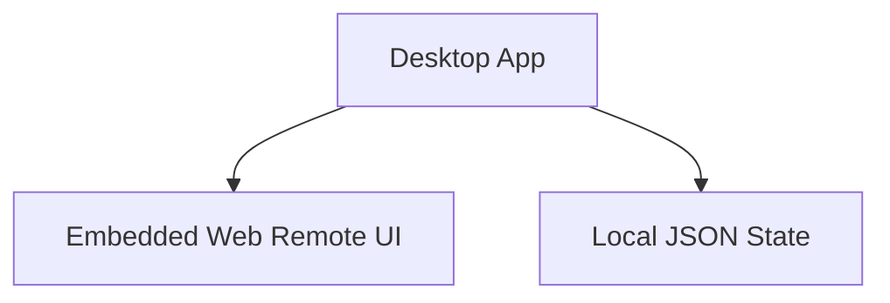
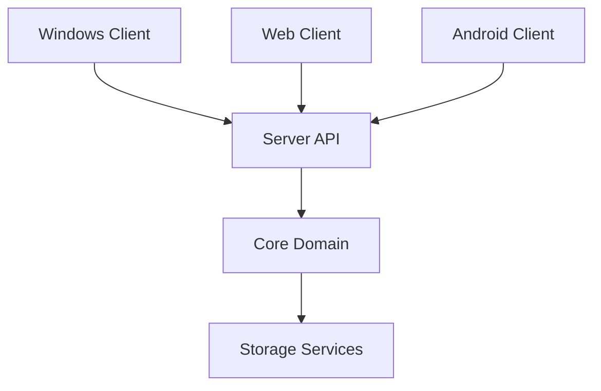
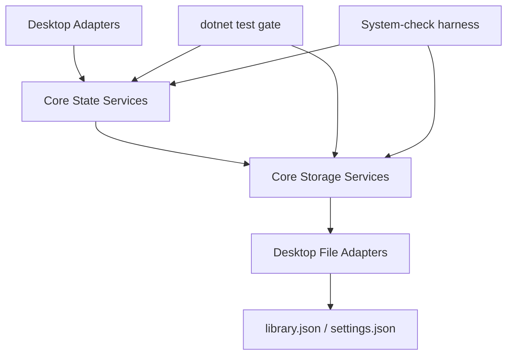
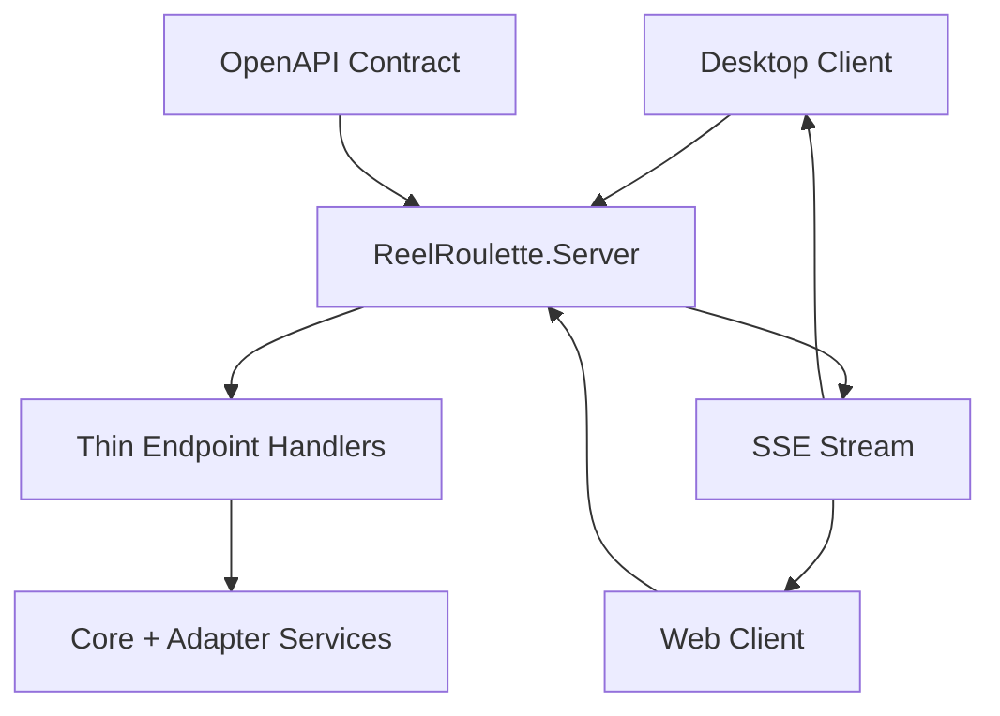
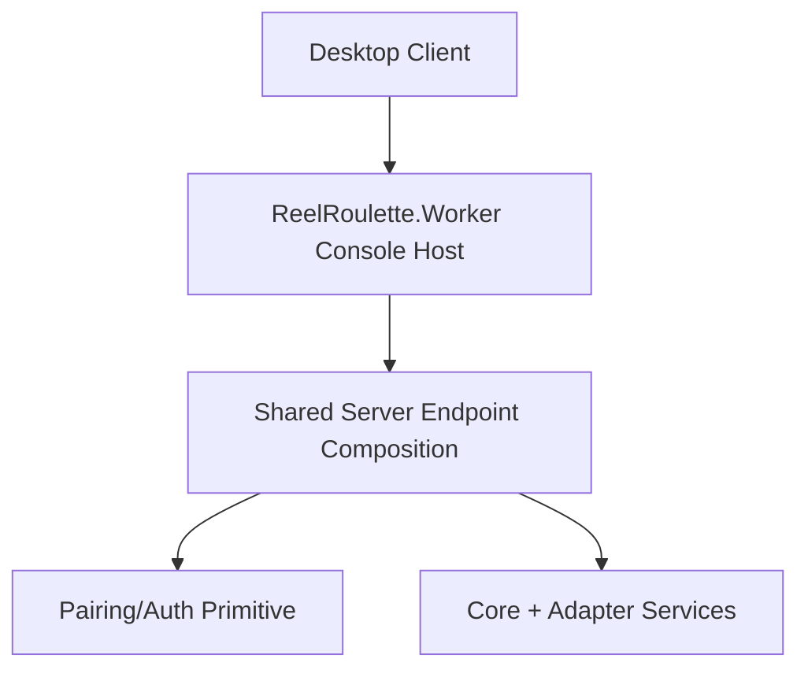

# Architecture

## Current State (M0 baseline)

## Target State

## M0/M1 Boundary

- M0 introduces the target repo layout and project stubs without changing runtime behavior.
- M1 extracts pure domain logic into `ReelRoulette.Core` with desktop adapters calling into core.
- Desktop UI remains the shipping runtime while core extraction happens by feature slice.

## M2 Storage-State Layering

- Core state services own randomization/filter/playback session primitives.
- Core storage services own JSON load/save and atomic write semantics.
- Desktop retains UI/media rendering concerns and uses adapters for persistence/state access.

## M3 Contract-First Server Seam

- `ReelRoulette.Server` now exposes initial query/command endpoints and an SSE event stream.
- OpenAPI is expanded to document live M3 endpoint contracts and event envelope shape.
- Desktop includes a local HTTP probe (`/api/version`) to prove the M3 integration boundary.
- M3 reconnect semantics are explicit: `Last-Event-ID` replay is attempted first, and clients re-fetch state (`/api/library-states`) when a revision gap exceeds replay retention.

## M4 Worker Runtime + Pairing/Auth

- `ReelRoulette.Worker` is now the headless runtime host for API/SSE in console-first mode.
- Pairing/auth now exists on the core server seam (`/api/pair` + auth middleware with optional localhost trust).
- Desktop has a lifecycle UX path to start core runtime when local probe fails.
- Server-thin guardrail for M4+: keep HTTP/SSE/auth glue in server; avoid introducing new business rules in endpoint handlers.
