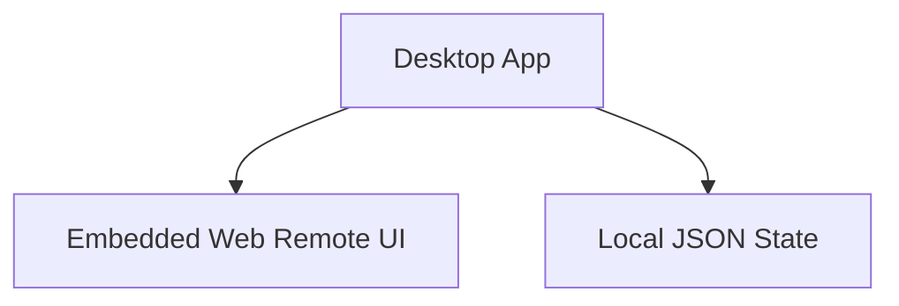
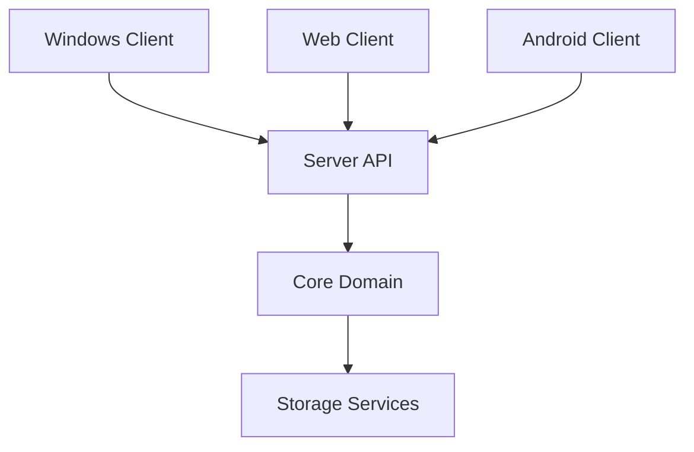
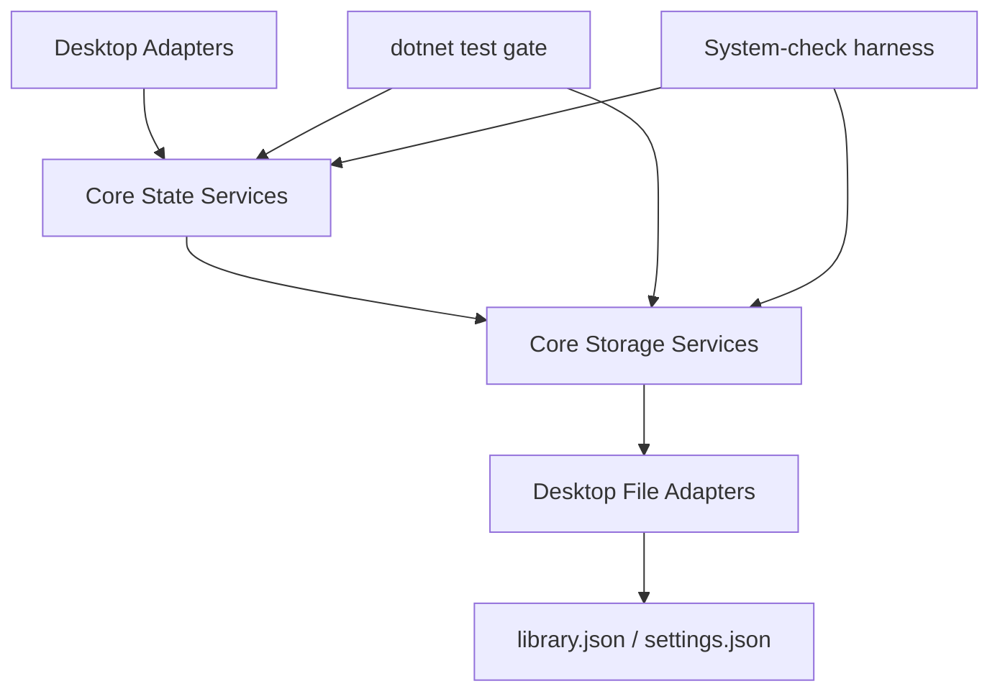
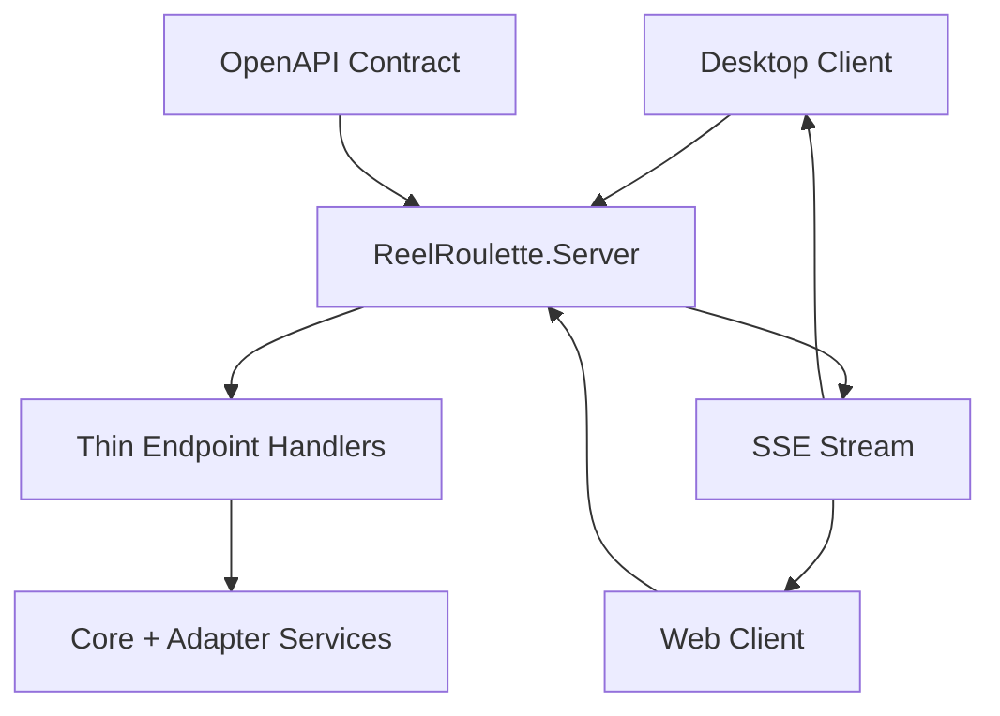
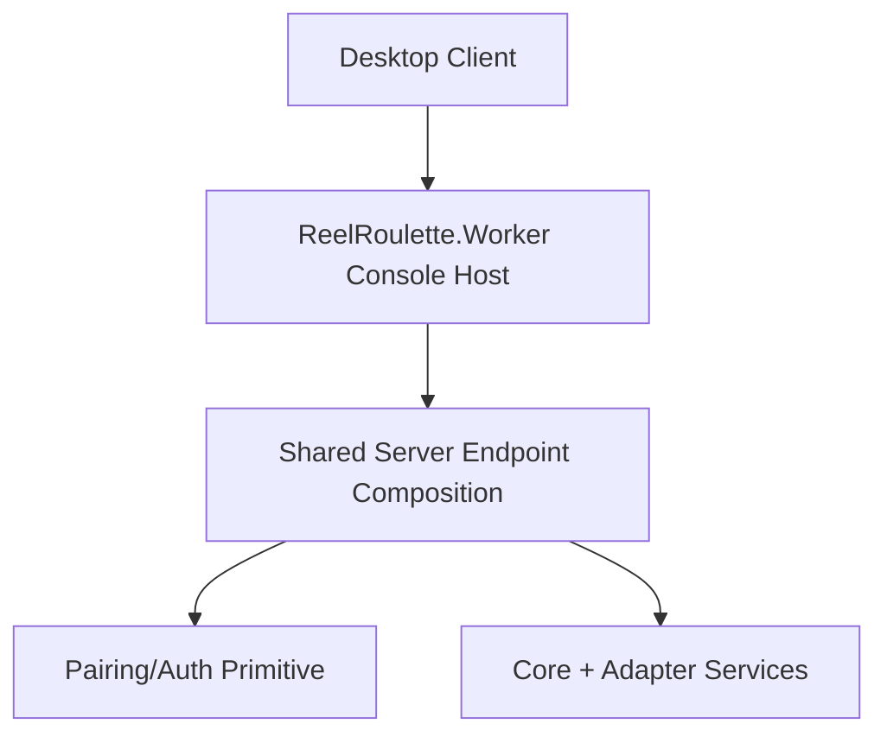
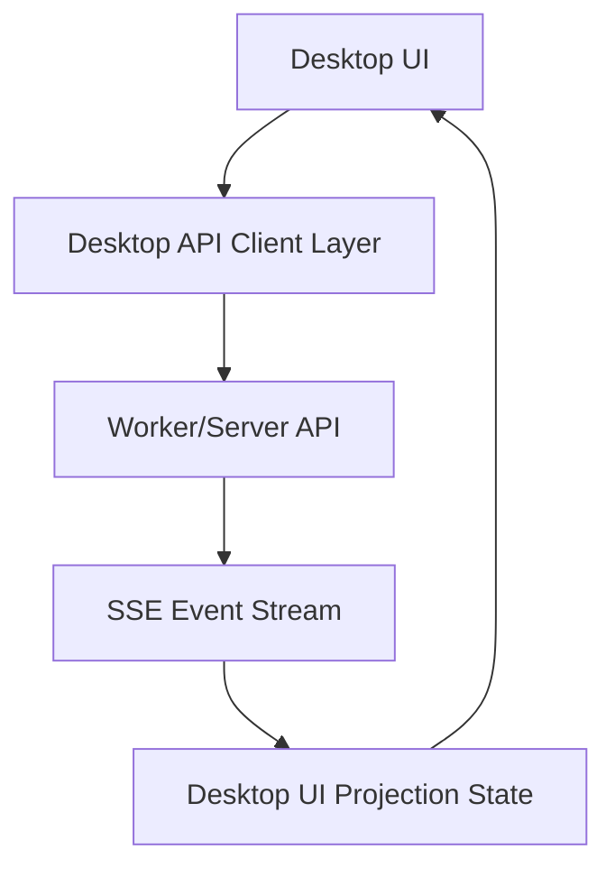
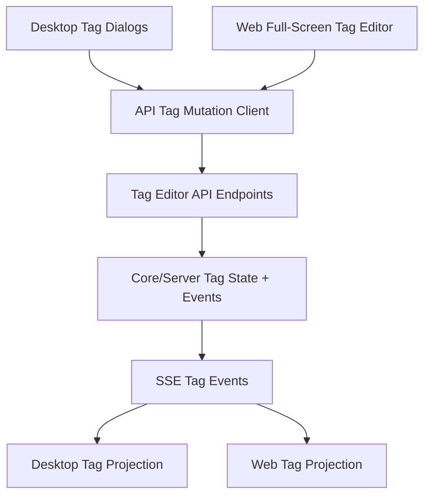
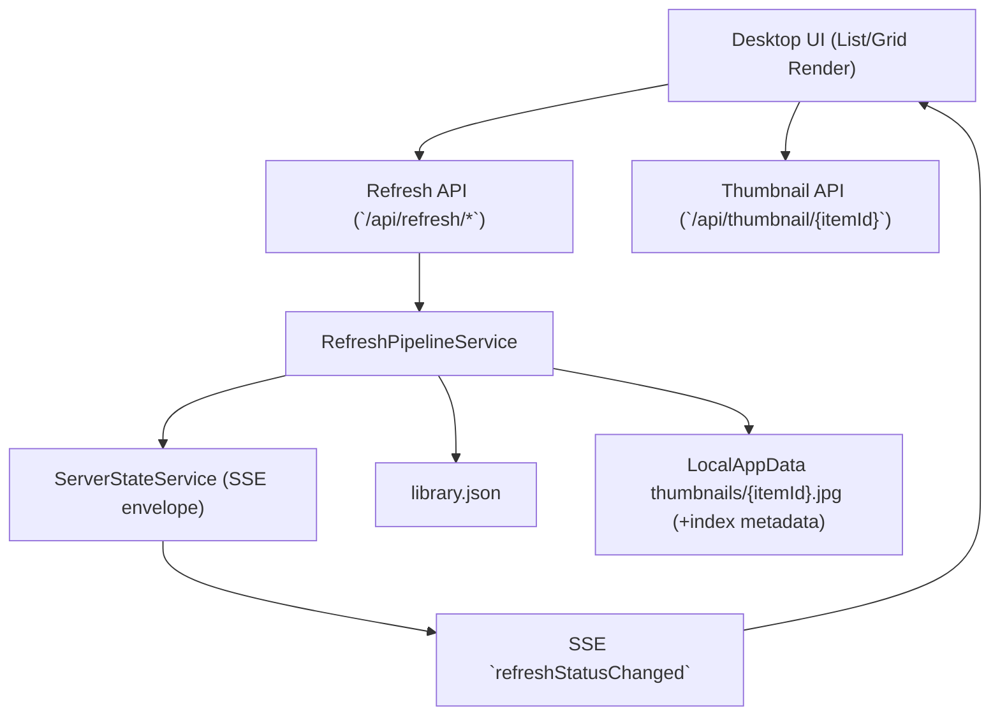

# Architecture

## Current State (M0 baseline)

## Target State

## M0/M1 Boundary

- M0 introduces the target repo layout and project stubs without changing runtime behavior.
- M1 extracts pure domain logic into `ReelRoulette.Core` with desktop adapters calling into core.
- Desktop UI remains the shipping runtime while core extraction happens by feature slice.

## M2 Storage-State Layering

- Core state services own randomization/filter/playback session primitives.
- Core storage services own JSON load/save and atomic write semantics.
- Desktop retains UI/media rendering concerns and uses adapters for persistence/state access.

## M3 Contract-First Server Seam

- `ReelRoulette.Server` now exposes initial query/command endpoints and an SSE event stream.
- OpenAPI is expanded to document live M3 endpoint contracts and event envelope shape.
- Desktop includes a local HTTP probe (`/api/version`) to prove the M3 integration boundary.
- M3 reconnect semantics are explicit: `Last-Event-ID` replay is attempted first, and clients re-fetch state (`/api/library-states`) when a revision gap exceeds replay retention.

## M4 Worker Runtime + Pairing/Auth

- `ReelRoulette.Worker` is now the headless runtime host for API/SSE in console-first mode.
- Pairing/auth now exists on the core server seam (`/api/pair` + auth middleware with optional localhost trust).
- Desktop auto-starts core runtime during launch when local probe fails.
- Server-thin guardrail for M4+: keep HTTP/SSE/auth glue in server; avoid introducing new business rules in endpoint handlers.

## M5 Desktop API-Client Migration

- Desktop command flows (favorite/blacklist/playback/random command) now delegate to the worker/server seam first.
- Desktop subscribes to SSE and applies projected item-state updates for cross-client sync.
- Desktop keeps the SSE stream alive with reconnect behavior and applies case-insensitive payload projection to avoid dropped updates.
- Legacy embedded web-remote mutation calls are contained by delegating through the same API-client path.

## M6a Web Tag Editing + Desktop Tag Migration

- M6a routes migrated tag/category/item-tag mutations through shared API contracts (`itemIds[]` batch-ready).
- Desktop dialogs remain UI orchestration while mutation authority moves to core/server API paths.
- Web tag editing keeps a combined ItemTags/ManageTags full-screen layout with touch-first controls, collapsible categories, and batched apply behavior for staged tag/category operations.
- Desktop seeds core tag catalog state on connect/start (`sync-catalog`) to prevent sparse server tag models and keep web/desktop tag views consistent.
- Desktop hydrates requested item-tag snapshots (`sync-item-tags`) before web model fetches so tag state projections match current item assignments.
- Category deletion no longer deletes tags; migrated flows always reassign category-owned tags to canonical `uncategorized` (fixed ID) for consistent multi-client behavior.

## M6b Grid/Thumbnails + Unified Refresh Pipeline

- Core runtime is the execution owner for refresh orchestration and scheduling.
- Desktop no longer exposes standalone duration/loudness scan menu actions; refresh runs through core API.
- Refresh settings ownership moved to core (`appsettings` + API updates), with client-side orchestration/render only.
- Desktop library panel now supports persisted list/grid mode with a justified responsive thumbnail grid (aspect-ratio preserved, variable-size cards) while preserving existing list-mode behavior.
