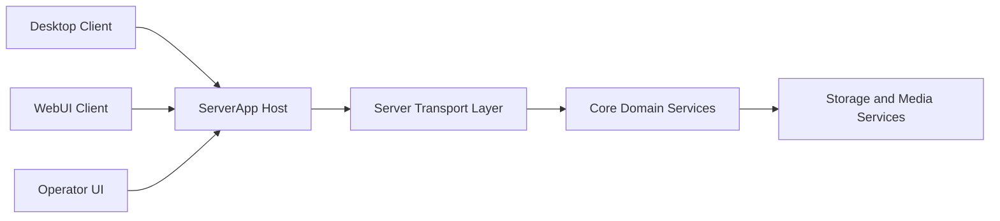

# Architecture

This document describes the current architecture of ReelRoulette and the boundaries contributors should preserve.
It is intentionally current-state only and does not track milestone chronology.

## Architecture Direction

ReelRoulette is an API-first, thin-client system:

- Core/server owns business logic and authoritative state.
- Desktop and WebUI are orchestration and rendering clients over API plus SSE.
- Shared contracts in `shared/api/openapi.yaml` align behavior across clients.

## High-Level Runtime Topology

```mermaid
flowchart LR
    desktop[Desktop Client]
    web[WebUI Client]
    operator[Operator UI]
    host[ServerApp Host]
    transport[Server Transport Layer]
    domain[Core Domain Services]
    data[Storage and Media Services]

    desktop --> host
    web --> host
    operator --> host

    host --> transport
    transport --> domain
    domain --> data
```

## Runtime Ownership

### ServerApp Host

`src/core/ReelRoulette.ServerApp` is the default runtime entrypoint.

- Hosts API, SSE, media, and static WebUI surfaces on a consolidated runtime path.
- Serves Operator UI and control-plane endpoints.
- Owns runtime lifecycle and settings apply/restart orchestration.
- Uses a thin host-UI abstraction:
  - Windows host path uses native tray runtime controls (`NotifyIcon`) for operator shortcuts.
  - non-Windows host path remains headless-compatible.
- Owns host-level startup-launch registration behavior:
  - Windows path uses per-user startup registration and exposes immediate toggle control via tray and Operator UI.
  - Linux path uses XDG autostart (`*.desktop`) with `Exec=`/`Path=` aimed at the stable binary (AppImage: **`APPIMAGE`** on-disk path, not the `/tmp/.mount_*` process path); the host pins ASP.NET content root to `AppContext.BaseDirectory` so autostart works when the session manager uses a non-install cwd.
  - Other non-Windows hosts without Linux XDG use a no-op startup-launch service without affecting server-core behavior.

### Server Transport Layer

`src/core/ReelRoulette.Server` is a thin composition boundary.

- Handles endpoint routing, auth middleware wiring, SSE/media transport, and DTO shaping.
- Exposes `POST /api/play/{itemId}` for explicit item playback: same response shape as random selection, with server-side stats update and `playbackRecorded` SSE (orchestration mirrors `record-playback` semantics).
- Maps transport contracts to domain services.
- Must not become the owner of business rules that belong in core services.

### Core Domain Layer

`src/core/ReelRoulette.Core` and server-side domain services are authoritative for behavior and state semantics.

- Own domain mutation rules, projection inputs, and persistence semantics.
- Execute library operations, refresh pipeline behavior, and randomization/filter logic. Random eligibility is the library list filter. Direct play reads one item and its source.
- Expose deterministic APIs for all migrated client flows.

### Client Layers

- Desktop client (`src/clients/desktop/ReelRoulette.DesktopApp/`, Avalonia) and WebUI (`src/clients/web/ReelRoulette.WebUI`) are orchestration/render layers.
- WebUI ships a small **PWA** surface (`manifest.webmanifest`, `index.html` install meta, `public/icons/*`, root `public/sw.js` registered in secure contexts for Chromium installability). The worker intercepts document navigations only. Build-time sync resizes shared PNG sources so declared icon sizes match shipped assets (see `scripts/sync-shared-icon.mjs`).
- Playback filtering and preset catalogs are edited through API-backed UIs on both clients (no client-authoritative filter catalogs).
- Clients issue command/query calls through APIs and project state from API plus SSE.
- Desktop library activation (grid) is server-authoritative via `POST /api/play/{itemId}`; local LibVLC render only, with no duplicate client `record-playback` for that start. Desktop library browse is an infinite-scrolling grid fed by `POST /api/library/query`. Connect and resync use library stats, the sources API, and the tag catalog. Now-playing reads the loaded tile or `POST /api/library/item`. The loudness baseline comes from library stats.
- WebUI Auto Tag performs filename/path matching only on the server. Auto-tag scan and duplicate scan read catalog rows and do not build the full catalog document. A full-library scan reads every item, a scan with no path list reads enabled sources, and an explicit list matches those full paths. Duplicate groups are ready fingerprints. Duplicate apply deletes the other files and catalog rows and leaves the kept item. The web client sends `scanFullLibrary` with no path list and applies selected suggestions via API without client-local tag-matching authority.
- WebUI library overlay grid uses a TypeScript port of Core `LibraryGridLayout` for justified-row packing and row-level virtual scrolling. Browse is `POST /api/library/query`; tile JPEGs load from `GET /api/thumbnail/{itemId}` using that page's thumbnail fields. The first page loads after connect and stays loaded across hide and show. Header counts stay the current query totals after a change that finishes while the overlay is hidden. Tile activation is server-authoritative via `POST /api/play/{itemId}` (overlay closes on success; no duplicate client `record-playback`). Favorite, blacklist, playback, and tag events patch or reload the loaded window whether the overlay is shown or hidden. `resyncRequired` reloads that window, does not fetch the full catalog, and does not post an empty item-state read.
- Clients must not reintroduce local authoritative mutation fallbacks for migrated domains.
- Library export and import run on the desktop and move only `library.db`. Export asks for a destination, then downloads a server catalog checkpoint into that file. Import replaces the live database after the server-stopped acknowledgment and can remap source folders. Import replaces presets and thumbnail revision and dimensions with the imported catalog. Settings and backups stay where they are. JPEG files stay in the local thumbnail directory until the next thumbnail stage completes, which generates thumbnails for the imported catalog and removes JPEG files that are not in it. A folder that still has only `library.json` with sources or items requires overwrite confirmation, and a successful import renames that file aside. An existing `library.db` that cannot be opened also requires that confirmation. If import fails before the new database is in place, the previous catalog is put back, and a folder that had no catalog is left without one. A cleanup failure after that leaves the imported catalog in place. The server writes the checkpoint and the `library.db.backup.*` files.

## Contracts and Compatibility

- OpenAPI (`shared/api/openapi.yaml`) is the source of truth for endpoint and schema contracts.
- `/api/version` and `/api/capabilities` provide compatibility and capability metadata used for client gating.
- Generated client contracts should stay in sync with OpenAPI and be verified in normal gates.

## Eventing and Projection

`GET /api/events` provides revisioned SSE envelopes used for client projection updates.

Envelope fields:

- `revision`
- `eventType`
- `timestamp`
- `payload`

Reconnect and recovery:

- Clients reconnect with revision continuity hints (`Last-Event-ID` and fallback query semantics where applicable).
- Server replays retained events when available.
- On replay gaps, server emits `resyncRequired`. WebUI reloads the loaded library list and does not post an empty item-state read. An item-state read returns only the requested paths.

## Auth and Access Model

- Pairing and auth are enforced on the server boundary.
- Session continuity is cookie-based for browser clients.
- Runtime policy controls CORS and cookie behavior.
- Localhost-friendly development access is supported by policy; LAN access remains explicitly policy-gated.

## Control Plane and Operator Surface

Control-plane endpoints under `/control/*` provide:

- runtime status and settings operations,
- pairing and lifecycle operations,
- testing mode and fault simulation controls,
- server log retrieval for diagnostics.

Operator UI is an operational surface and does not own domain logic.

## Media, Playback, and Missing Media Behavior

- Clients request random/playback targets through server-authoritative APIs.
- Media fetch paths and missing-media error semantics are contract-defined and consistent across clients.
- Desktop playback policy can use local-first with API fallback where configured, while preserving server-authoritative flow contracts.

## Refresh, Thumbnail, and Processing Pipeline

- Refresh orchestration and scheduling are core/server-owned.
- Refresh state is exposed through API and SSE projection updates.
- The refresh pipeline includes a `fingerprintScan` stage (server-side full-file SHA-256 for items that need hashing) before duration/loudness/thumbnail work; parallelism is configurable via core refresh settings. Each stage writes the columns it owns as that file finishes and does not load the full catalog document. A catalog backup for that refresh is taken after the refresh finishes and still follows the backup gap. A shorter backup gap applies on the next catalog save.
- Thumbnail generation is pipeline-owned and retrieval is API-served. Revision, width, and height are stored on the item. A thumbnail whose stored revision still matches the item's fingerprint, size, and write time is reused without walking that source file. The stage writes those columns as the item finishes. When the thumbnail stage completes, a JPEG whose item is not in the catalog is deleted. Opening the catalog does not delete those files. Refresh does not delete thumbnails for items still in the library to stay under a file-count or byte cap. JPEG files stay in the local thumbnail directory.
- Clients render status and results; they do not own processing authority.

## Logging and Diagnostics

- Server runtime logging is centralized for operational diagnostics.
- Clients can relay structured logs to server ingestion endpoints.
- Connected-client/session diagnostics and testing controls are exposed through operator/control-plane APIs.

## Packaging and Delivery

- **Velopack** is the sole packaging path. **`.github/workflows/release.yml`** builds self-contained ServerApp and DesktopApp outputs per OS, stages WebUI assets on server legs, bundles Windows native dependencies in CI, packs with `vpk`, and publishes update feeds to Backblaze B2 under `reelroulette/{server|desktop}` with optional `-dev` tier prefixes. Update channels are named `{os}-{component}` for stable (`win-server`, `linux-desktop`, …) and `{os}-{component}-dev` for dev builds; each prefix holds the feeds for that component and tier. On Windows, Velopack produces a per-user `Setup.exe` (install under `%LocalAppData%`, no MSI, no elevation, no portable zip). Linux legs produce AppImage-style Velopack bundles. Stable tag releases mirror those installers (`Setup.exe` / `.AppImage`) onto the existing GitHub release; update packages and feed JSON stay on B2; dev releases publish to B2 only. **Velopack-installed** ServerApp and DesktopApp run `VelopackApp` hooks at startup and check feeds in normal use: background **check-only** polling, with download and apply as confirmed operator/Settings actions (never auto-restart).
- **Linux AppImage hosts:** When the `APPIMAGE` environment variable is set, ServerApp and DesktopApp reconcile Freedesktop menu entries and hicolor icons under the user’s XDG data home on each launch (silent self-registration; `Exec=` tracks the current AppImage path). Dev/`dotnet run` sessions skip this path.
- ServerApp runtime uses an Avalonia-hosted tray when a compatible desktop session is available; otherwise it runs deterministically in a headless mode.
- CI workflow **`ci.yml`** validates build/test/contract/web checks. **`release.yml`** is the packaging and publish gate on tag / manual dispatch. Local **`verify-linux-packaged-server-smoke.sh`** exercises a Velopack Linux server AppImage headlessly.
- Release version metadata should remain aligned across contract, runtime, project, and package surfaces via **`set-release-version.ps1`** and repo-root **`.version`**.

## Repository Map

- `src/core/ReelRoulette.Core`: domain logic and storage abstractions.
- `src/core/ReelRoulette.Server`: transport/composition layer.
- `src/core/ReelRoulette.ServerApp`: default runtime host and operator surface.
- `src/clients/web/ReelRoulette.WebUI`: web client orchestration.
- `src/clients/desktop/ReelRoulette.DesktopApp/`: Desktop client orchestration and rendering (Avalonia).
- `shared/api/openapi.yaml`: canonical API contract source.

## Guardrails

- Keep server layer thin and move business rules into core services.
- Preserve API-authoritative behavior for migrated flows.
- Keep desktop and web behavior aligned through shared contracts and SSE semantics.
- Avoid client-local authoritative fallback paths in migrated domains.
- Keep this file current-state only; avoid historical/future narrative here.

## Related Documents

- `README.md`: onboarding and common run/test/package commands.
- `docs/api.md`: endpoint and integration contract baseline.
- `docs/dev-setup.md`: setup, local workflow, and verification details.
- `docs/domain-inventory.md`: ownership-first implementation map.
- `CONTEXT.md`: concise capability and repository context.
- `MILESTONES.md`: planning, scope tracking, and acceptance evidence.
